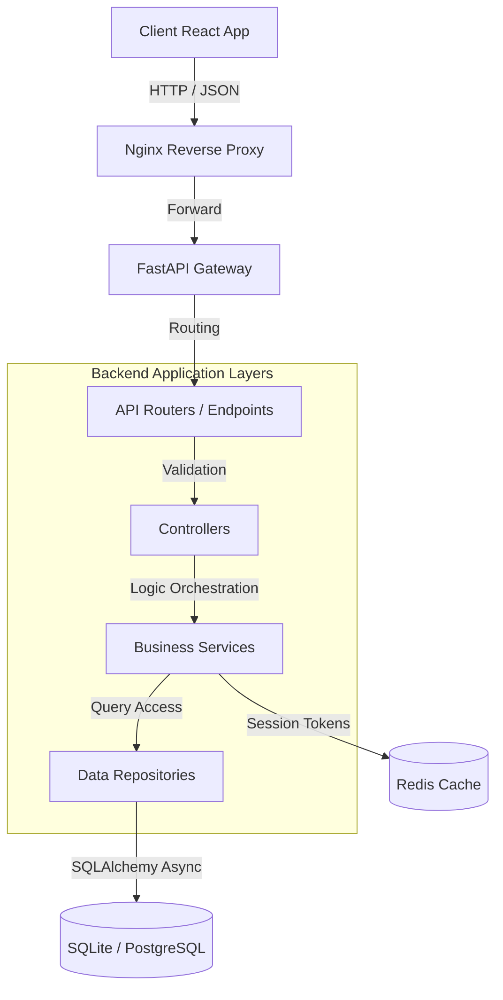

# 🏫 CampusOS ERP — Enterprise College Management System Portal

[](https://fastapi.tiangolo.com)
[](https://react.dev)
[](https://www.typescriptlang.org)
[](https://tailwindcss.com)
[](https://www.docker.com)
[](file:///LICENSE)

CampusOS is a state-of-the-art, enterprise-grade College ERP and Management System. Designed for university-scale operations, it adopts a modular architectures, robust security controls, automated testing, and future-proof cloud readiness.

---

## 🏛️ System Architecture Flow

The system uses a highly decoupled layered architecture (Controller-Service-Repository pattern) for clear separation of concerns, transactional stability, and maintainability.



---

## ✨ Features Overview

### 🔒 1. Security & Identity Management
- **MFA (TOTP)**: Integrated Time-Based One-Time Password verification (RFC 6238) with clock-drift checks.
- **Access Control**: Robust Role-Based Access Control (RBAC) whitelisting route guards on the frontend (`RoleRoute`) and endpoint checks (`PermissionChecker`) on the backend.
- **XSS Protections**: Access tokens stored purely in-memory with sessionStorage-based refresh tokens.
- **API Protections**: Strict CORS Allowed Origin mappings and rate-limiting rules.

### 🏛️ 2. Academic & Course Administration
- **Syllabus Progress**: Visual completion trackers for courses and subjects.
- **Dynamic Entities**: Interactive management for Departments, Degrees, Courses, and Subjects.

### 👥 3. Student & Parent Portals
- **Coursework & Grades**: View academic marks ledger, CGPA trackers, and historical statistics.
- **Coursework Uploads**: Complete online Assignments Hub for submissions and faculty review feedback.
- **Parent Hub**: Specialized access to attendance history, billing receipts, and course schedules.

### 💼 4. Faculty & Operations
- **Schedules**: Unified class scheduling and timetable slots.
- **Leaves Ledger**: Staff portal to apply for, track, and approve academic leaves.
- **Grades Submission**: Faculty tools to log daily attendance and post semester exam results.

### 💳 5. Finance & Library Logs
- **Billing Ledgers**: Unified payment gateways to clear tuition dues and download receipt invoices.
- **Library Tracker**: Book checkout catalog, borrow logs, and auto-overdue fine calculations.

---

## 📂 Project Structure

```
COLLEGE MANAGEMENT SYSTEM/
├── apps/
│   └── web/                   # React 19 Frontend Client (TypeScript + Tailwind CSS)
│       ├── src/
│       │   ├── api/           # API fetch client service modules
│       │   ├── components/    # Layout, UI components, ErrorBoundary, PageSkeleton
│       │   ├── context/       # AuthContext, RoleContext, DatabaseContext, ThemeContext
│       │   └── pages/         # Lazy-loaded page views (Dashboard, Timetable, Assignments)
│       └── Dockerfile         # Multi-stage Nginx Frontend build configuration
├── backend/
│   ├── app/                   # FastAPI Backend Gateway
│   │   ├── controllers/       # Controller routers logic mapping
│   │   ├── core/              # Config, Security settings, Limiter setup
│   │   ├── database/          # Session creation, Base DB models
│   │   ├── models/            # SQLAlchemy database entities (70-100 normalized fields)
│   │   ├── repositories/      # SQL database operations (Repositories pattern)
│   │   ├── routers/           # FastAPI router endpoints (RBAC checks)
│   │   ├── schemas/           # Pydantic validation schemas
│   │   └── services/          # Business logic layers (validations, rules)
│   ├── tests/                 # 100% passed async integration test suites
│   ├── Dockerfile             # Python runtime builder
│   └── requirements.txt       # Python libraries manifest
├── docker-compose.yml         # Production containers configuration (PostgreSQL 16 + Redis 7)
├── docker-compose.dev.yml     # Hot-reloading development environment (SQLite)
├── LICENSE                    # Proprietary License (All Rights Reserved)
├── SECURITY.md                # Security architecture & Vulnerability report policies
└── CONTRIBUTING.md            # Guidelines for filing PRs and reporting bugs
```

---

## 🚀 Quickstart Guide

### Option A: Local Host Development (Recommended)

#### 1. Backend API Setup
1. Open a terminal in the `backend/` directory.
2. Initialize virtual environment and install packages:
   ```powershell
   python -m venv venv
   .\venv\Scripts\activate
   pip install -r requirements.txt
   ```
3. Boot up the FastAPI reload server:
   ```powershell
   python -m uvicorn app.main:app --port 8000 --reload
   ```

#### 2. Frontend client Setup
1. Open a terminal in the `apps/web/` directory.
2. Install npm packages:
   ```bash
   npm install
   ```
3. Boot up the Vite dev server:
   ```bash
   npm run dev
   ```
4. Access the web app at [http://localhost:5173/](http://localhost:5173/).

---

### Option B: Docker Container Setup (Production Mode)

Ensure Docker Desktop is running, then boot up the environment from the project root:
```bash
docker compose up --build
```
This automatically spins up:
- **Web Frontend**: [http://localhost:3000/](http://localhost:3000/)
- **API Backend**: [http://localhost:8000/docs](http://localhost:8000/docs)
- **Database**: PostgreSQL 16
- **Cache**: Redis 7

---

## 🧪 Running Tests

Validate changes against the backend async test suite:
```bash
cd backend
$env:PYTHONPATH="."
venv\Scripts\python -m pytest tests/ -v
```

---

## 📄 License & Legal

This project is proprietary and confidential. All rights are reserved to **Rishi Sharma**. Unauthorized copying, modification, or distribution is strictly prohibited. For details, refer to the [LICENSE](file:///LICENSE) and [SECURITY.md](file:///SECURITY.md).
