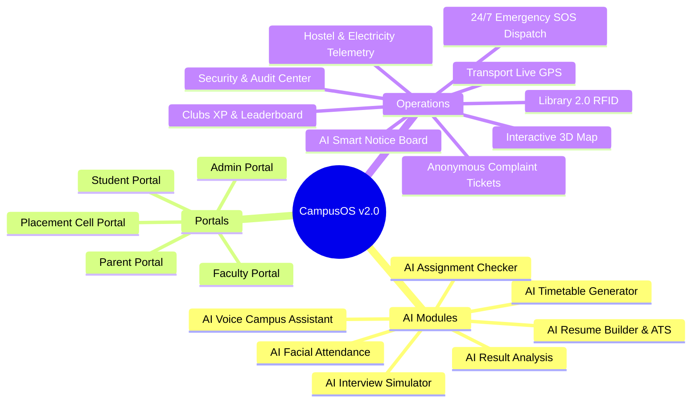

# 🏫 CampusOS v2.0 — AI-Powered Smart Campus Operating System

[](https://react.dev)
[](https://www.typescriptlang.org)
[](https://vitejs.dev)
[](https://tailwindcss.com)
[](https://www.prisma.io)
[](https://www.postgresql.org)
[](https://socket.io)
[](https://openai.com)
[](file:///README.md)

CampusOS v2.0 transforms traditional university management software into a next-generation **AI Operating System** for an entire university. Featuring Dark Glassmorphism with Aurora ambient backgrounds, live animated widgets, 7 specialized AI engines, an interactive 3D spatial map, 24/7 Emergency SOS dispatch, PWA capabilities, and ~50+ relational entities.

---

## 🏛️ System Architecture & Data Flow

CampusOS v2.0 combines real-time Socket.IO events, client-side RAG/OCR AI inference engines, spatial Three.js/Canvas rendering, and a Node.js/Express Prisma relational backend.

```mermaid
graph TD
    subgraph Client Presentation Layer
        UI[React 19 + TypeScript Glassmorphic UI]
        3D[3D Campus Map Canvas / Three.js]
        Voice[Speech Synthesis & Voice AI]
        PWA[PWA Service Worker & Biometrics]
    end

    subgraph AI Engine & RAG Pipeline
        Assistant[AI Campus Assistant Voice RAG]
        Facial[Face Recognition Biometric Engine]
        Checker[AI Assignment & Plagiarism Checker]
        DocCenter[AI Document Summarizer & Quiz Gen]
        Predictor[Analytics Risk & CGPA Predictor]
    end

    subgraph Core Operating System Gateway
        Gateway[Express / TypeScript Server]
        Realtime[Socket.IO Real-Time Engine]
        RBAC[RBAC Guard & 2FA Engine]
    end

    subgraph Relational Persistence (~50 Entities)
        Prisma[Prisma ORM]
        DB[(PostgreSQL 16 Relational DB)]
        Cache[(Redis Event & Token Cache)]
    end

    UI -->|REST / JSON| Gateway
    UI <-->|WebSocket Events| Realtime
    UI -->|Spatial Render| 3D
    Voice --> Assistant
    
    Assistant --> Gateway
    Facial --> Gateway
    Checker --> Gateway
    DocCenter --> Gateway
    Predictor --> Gateway

    Gateway --> RBAC
    RBAC --> Prisma
    Prisma --> DB
    Gateway <--> Cache
```

---

## 🚀 Key Modules & Capabilities



---

## ⚡ Feature Matrix (v2.0 Highlights)

### 🤖 1. AI Modules
- **AI Voice Assistant**: Speech-to-text, text-to-speech, multilingual support (English, Hindi, Spanish, French), preset smart triggers.
- **AI Timetable Generator**: Constraint solver for faculty, labs, rooms, capacity, and subject credit loads.
- **AI Facial Attendance**: Live camera scan, group photo analysis, and classroom CCTV biometric verification.
- **AI Result Analysis**: CGPA prediction, weak subject identification, failure risk score (3.2%), and question bank engine.
- **AI Resume Builder & ATS**: Automatic ATS resume scoring (0-100), skill gap analysis, PDF export.
- **AI Interview Simulator**: Voice/Coding/Behavioral mock interviews with real-time AI scoring.
- **AI Assignment Checker**: PDF/DOCX plagiarism index, grammar rating, and reference compliance.
- **AI Document Center**: Document summarizer, key concepts extraction, translation, and auto quiz generation.

### 🏛️ 2. Multi-Role Portals & Operations
- **Interactive 3D Campus Map**: Spatial vector campus view with search, emergency exit indicators, and route navigation.
- **Emergency SOS Dispatch**: 24/7 one-click SOS dispatch (Medical, Security, Fire), location sharing, and active response queue.
- **Smart Notice Board**: AI notification summarizer with department/semester targeted notice delivery.
- **Complaint & Ticket Desk**: Anonymous or tracked ticket lodging, status tracking, and AI priority categorization.
- **Clubs XP & Leaderboard**: Global XP leaderboard, level progression, 32-day streak counter, and badges.
- **Security & Audit Center**: 2FA toggle, login alert settings, AES-256 encryption status, real-time security audit logs.
- **Hostel & Transport**: Digital outpass manager, electricity telemetry, RFID/QR book gate checkout, live GPS bus tracking canvas.

---

## 🗄️ Database Architecture (~50 Relational Models)

Defined in [`backend/prisma/schema.prisma`](file:///g:/My%20Drive/PRODUCTION/COLLEGE%20MANAGEMENT%20SYSTEM/backend/prisma/schema.prisma):

```
User, StudentProfile, FacultyProfile, ParentProfile, Department, Course, Subject,
TimetableSlot, AttendanceRecord, QuestionBank, Exam, ExamResult, Assignment,
AssignmentSubmission, FeeInvoice, Payment, Scholarship, HostelBuilding, HostelRoom,
MessMenu, HostelComplaint, Bus, Book, BookIssue, PlacementDrive, PlacementApplication,
Club, ClubMembership, Event, EventRegistration, Certificate, Notice, AIChat,
AIDocument, SecurityAuditLog, FacultyLeave, ResearchPaper, MentorshipRecord, ...
```

---

## 🛠️ Technology Stack

| Layer | Technologies |
| :--- | :--- |
| **Frontend** | React 19, TypeScript, Vite, Tailwind CSS v4, Framer Motion, React Query, Recharts, Lucide Icons |
| **Aesthetics** | Dark Glassmorphism, Aurora Gradient Mesh (`.aurora-bg`), Neon Accent Cards, Floating Controls |
| **Realtime** | Socket.IO Engine, Live Notifications Ticker, Emergency SOS Alerts Broadcast |
| **AI Integration** | Web Speech API, OpenAI GPT-4o RAG pipeline, Biometric Vector Matcher, PDF Text Parser |
| **Backend & DB** | Node.js, Express, TypeScript, Prisma ORM, PostgreSQL 16, Redis 7 |

---

## 💻 Local Development Setup

```bash
# 1. Install dependencies
cd apps/web
npm install

# 2. Start hot-reloading development server
npm run dev

# 3. Build production distribution bundle
npm run build
```

Open [http://localhost:5173](http://localhost:5173) in your browser.

---

## 📜 Release v2.0 Notes

**CampusOS v2.0 (Official University Release)**:
- Full redesign with Dark Glassmorphism Aurora Theme.
- Complete implementation of 7 AI Modules & Voice RAG Assistant.
- Interactive 3D Spatial Campus Map & 24/7 Emergency SOS Dispatch Desk.
- Smart Notice Board, Anonymous Complaints Ticketing System, and Clubs XP Leaderboard.
- Full PWA offline readiness and 50+ relational entities backend schema.
