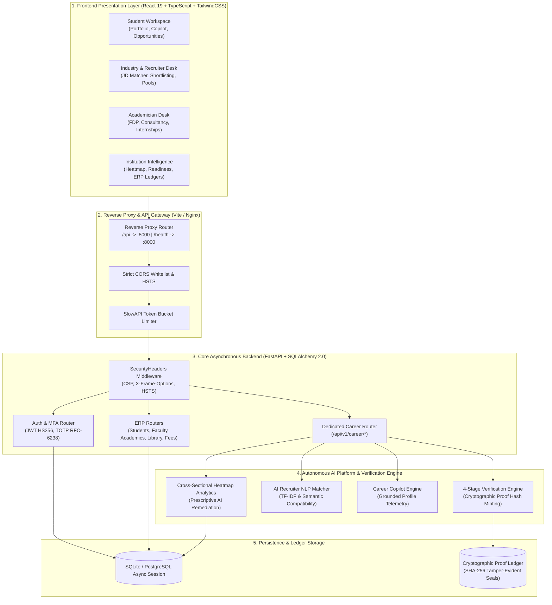
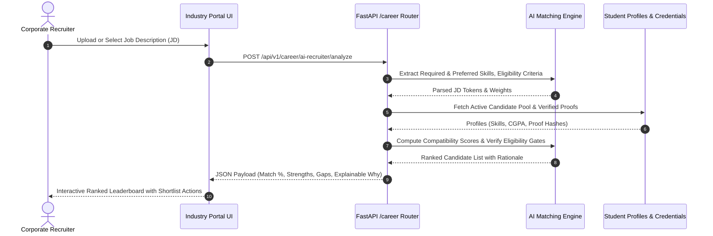
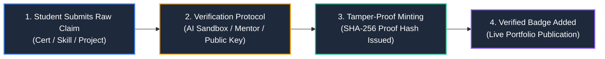
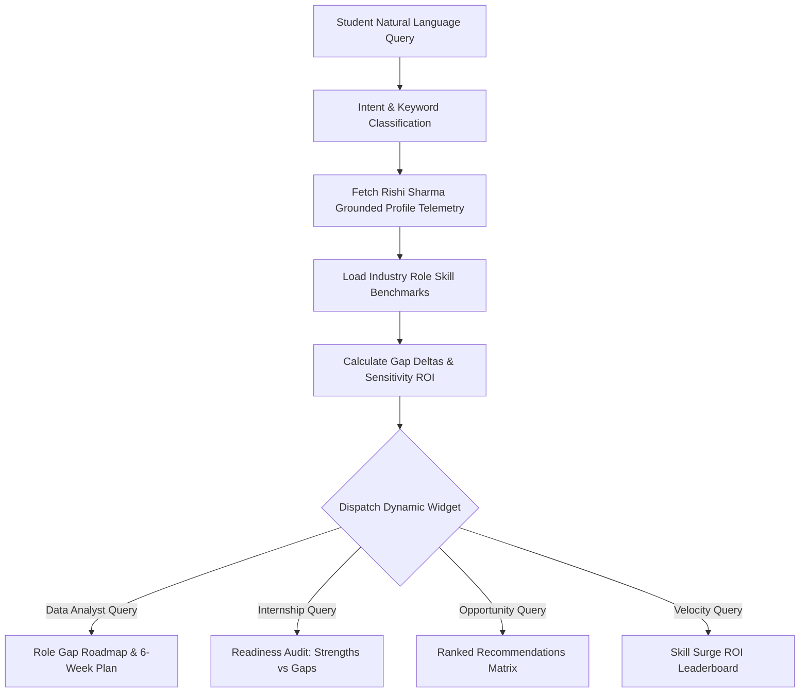
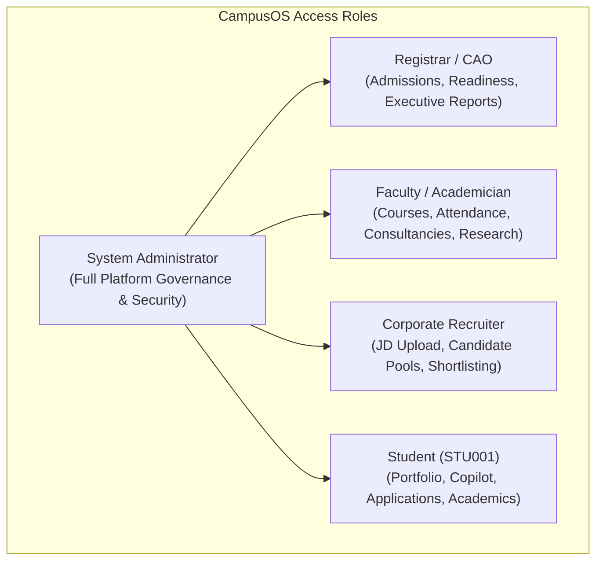

# 🏛️ CampusOS AI — Enterprise University Operating System & Employability Platform
### Smart India Hackathon 2026 (SIH26044) — Enterprise Edition v3.5.0


[](https://rishisharma029.github.io/campusOS/)
[](https://github.com/Rishisharma029/campusOS/actions)

> 🚀 **Live Interactive Demo**: [https://rishisharma029.github.io/campusOS/](https://rishisharma029.github.io/campusOS/)  
> 🔑 **Demo Portal Credentials**:  
> - **System Administrator**: `admin@campusos.edu` / `Admin@123456`  
> - **Benchmark Candidate (Rishi Sharma)**: `rishi.sharma@university.edu` / `Rishi@123456`  
> - **Two-Factor Authentication (2FA)**: Enter any 6-digit OTP code in Demo mode.

> **CampusOS AI** is an enterprise-grade university operating system and employability intelligence platform. It bridges higher education daily administration, executive governance, and student employability through a unified **3-Layer Architecture** and dedicated **SIH26044 Employability Ecosystem** (Verifiable Portfolios, AI Recruiter, Academician Portal, Institutional Intelligence, and AI Career Copilot).

---

## 📋 Table of Contents
1. [Problem Statement & SIH26044 Context](#-problem-statement--sih26044-context)
2. [End-to-End System Architecture](#-end-to-end-system-architecture)
3. [SIH26044 Employability Modules](#-sih26044-employability-modules)
   - [Digital Employability Portfolio & Verifiable Credentials](#1-digital-employability-portfolio--verifiable-credentials)
   - [AI Recruiter Engine & Candidate Ranking](#2-ai-recruiter-engine--candidate-ranking)
   - [Academician & Faculty Portal](#3-academician--faculty-portal)
   - [Institution Intelligence Dashboard & Skill-Gap Heatmap](#4-institution-intelligence-dashboard--skill-gap-heatmap)
   - [4-Stage Verification & Trust Architecture](#5-4-stage-verification--trust-architecture)
   - [CampusOS AI Career Copilot](#6-campusos-ai-career-copilot)
4. [Enterprise Core ERP Modules](#-enterprise-core-erp-modules)
5. [Process Flowcharts & Interaction Sequences](#-process-flowcharts--interaction-sequences)
6. [Technology Stack](#-technology-stack)
7. [Security & RBAC Architecture](#-security--rbac-architecture)
8. [API Route Directory](#-api-route-directory)
9. [Installation & Local Setup](#-installation--local-setup)
10. [Automated Testing & Verification](#-automated-testing--verification)
11. [Community & Code of Conduct](#-community--code-of-conduct)

---

## ❓ Problem Statement & SIH26044 Context

Higher education institutions face a profound structural gap between academic preparation and industry employability:
1. **Unverified Student Claims**: Traditional resumes and static profiles are saturated with unverified claims, making candidate discovery slow, manual, and unreliable for corporate recruiters.
2. **Disconnected Industry-Academia Feedback Loops**: Faculty internships, industrial training programs, and sponsored consultancies remain siloed with no direct pipeline into student mentoring.
3. **Delayed Institutional Decision-Making**: Academic leaders lack cross-sectional visibility into year-wise skill deficiencies (e.g., DSA vs. Cloud vs. Communication), leading to misalignment between curriculum delivery and market demands.
4. **Generic Career Guidance**: Students receive generic advice rather than grounded, data-driven remediation roadmaps matched to their verified academic records.

### The CampusOS Solution
CampusOS AI addresses SIH26044 by providing an integrated ecosystem connecting **Students**, **Academicians**, **Corporate Recruiters**, and **University Administrators** through verifiable proof hashes, automated JD skill matching, 4-stage claim verification, and grounded AI copilots.

---

## 🏗️ End-to-End System Architecture

CampusOS AI operates across an integrated full-stack architecture combining a reactive TypeScript frontend, an asynchronous FastAPI REST backend, and autonomous multi-agent intelligence services.


```mermaid
flowchart TB
    subgraph ClientLayer ["1. Frontend Presentation Layer (React 19 + TypeScript + TailwindCSS)"]
        UI_STUDENT["Student Workspace<br/>(Portfolio, Copilot, Opportunities)"]
        UI_INDUSTRY["Industry & Recruiter Desk<br/>(JD Matcher, Shortlisting, Pools)"]
        UI_ACAD["Academician Desk<br/>(FDP, Consultancy, Internships)"]
        UI_ADMIN["Institution Intelligence<br/>(Heatmap, Readiness, ERP Ledgers)"]
    end

    subgraph GatewayLayer ["2. Reverse Proxy & API Gateway (Vite / Nginx)"]
        PROXY["Reverse Proxy Router<br/>/api -> :8000 | /health -> :8000"]
        CORS["Strict CORS Whitelist & HSTS"]
        RATE["SlowAPI Token Bucket Limiter"]
    end

    subgraph BackendLayer ["3. Core Asynchronous Backend (FastAPI + SQLAlchemy 2.0)"]
        AUTH_ROUTER["Auth & MFA Router<br/>(JWT HS256, TOTP RFC-6238)"]
        CAREER_ROUTER["Dedicated Career Router<br/>(/api/v1/career/*)"]
        ERP_ROUTERS["ERP Routers<br/>(Students, Faculty, Academics, Library, Fees)"]
        SEC_MW["SecurityHeaders Middleware<br/>(CSP, X-Frame-Options, HSTS)"]
    end

    subgraph IntelligenceLayer ["4. Autonomous AI Platform & Verification Engine"]
        VERIFY_ENGINE["4-Stage Verification Engine<br/>(Cryptographic Proof Hash Minting)"]
        RECRUITER_ENGINE["AI Recruiter NLP Matcher<br/>(TF-IDF & Semantic Compatibility)"]
        COPILOT_ENGINE["Career Copilot Engine<br/>(Grounded Profile Telemetry)"]
        HEATMAP_ENGINE["Cross-Sectional Heatmap Analytics<br/>(Prescriptive AI Remediation)"]
    end

    subgraph DataLayer ["5. Persistence & Ledger Storage"]
        DB[("SQLite / PostgreSQL Async Session")]
        PROOFS[("Cryptographic Proof Ledger<br/>(SHA-256 Tamper-Evident Seals)")]
    end

    ClientLayer --> PROXY
    PROXY --> CORS
    CORS --> RATE
    RATE --> SEC_MW
    SEC_MW --> AUTH_ROUTER
    SEC_MW --> CAREER_ROUTER
    SEC_MW --> ERP_ROUTERS

    CAREER_ROUTER --> VERIFY_ENGINE
    CAREER_ROUTER --> RECRUITER_ENGINE
    CAREER_ROUTER --> COPILOT_ENGINE
    CAREER_ROUTER --> HEATMAP_ENGINE

    AUTH_ROUTER --> DB
    ERP_ROUTERS --> DB
    VERIFY_ENGINE --> PROOFS
    HEATMAP_ENGINE --> DB
```

---

## 🎯 SIH26044 Employability Modules

### 1. Digital Employability Portfolio & Verifiable Credentials
- **Canonical Route**: `/career/portfolio`
- **Candidate Benchmark**: **Rishi Sharma** (B.Tech CSE, CGPA: **9.24**, Readiness: **84%**).
- **Core KPIs**: 17 Verified Skills, 8 Certifications, 6 Production Repositories, 2 Corporate Internships.
- **Verifiable Passport Hash**: `0xGENOVA9942FA71C0B819E752D8A4`.
- **Top Skills Showcase**:
  - React: **91%** (Verified by Frontend Systems Rig & CodeBench)
  - Python: **82%** (Verified by Algorithmic Coding Sandbox)
  - SQL: **74%** (Verified by PostgreSQL Advanced Indexing Benchmark)
- **Interactive Verification Proof Modal**: Click any `✓ VERIFIED` badge to audit the authority, date, assessment score, and immutable SHA-256 ledger hash.

### 2. AI Recruiter Engine & Candidate Ranking
- **Canonical Route**: `/career/ai-recruiter`
- **Automated JD Parsing**:
  - Automatically extracts **Required Skills**, **Preferred Skills**, **Eligibility Criteria** (Degree, Min CGPA, Batch), and **Experience Level**.
  - Provides sample enterprise JDs (Autonomous Mobility Engineer, Full-Stack AI Engineer, Cloud Systems Architect).
- **AI Compatibility Ranking**:
  ```
  1. Rishi Sharma       94% Match  (Strong Match  •  Eligible)
  2. Aditi Verma        89% Match  (Strong Match  •  Eligible)
  3. Rohan Iyer         83% Match  (Moderate Match •  Eligible)
  4. Sneha Patel        78% Match  (Moderate Match •  Eligible)
  ```
- **Explainable Match Rationale**: Explains *why* each candidate matches (e.g. `Strong synergy in ROS2, Python, C++ with capstone verified project (Autonomous Mobility); CGPA 9.24 > 8.00 requirement`).

### 3. Academician & Faculty Portal
- **Canonical Route**: `/career/academician`
- Designed specifically for university faculty and academic leaders across 7 strategic domains:
  1. **Faculty Internships**: Short-term industrial sabbaticals at partner corporations.
  2. **Industrial Training**: Technology refresh programs with industry mentors.
  3. **Faculty Development Programs (FDP)**: AI, Cloud, and Embedded Systems certifications.
  4. **Consultancy Engagements**: Industry consulting problem statements with revenue-sharing tracking.
  5. **Collaborative Research**: Co-funded industry-university R&D projects and patents.
  6. **Industry Mentorship**: Joint capstone project advisory pairing.
  7. **Institutional Collaboration**: MoUs and corporate lab sponsorship management.

### 4. Institution Intelligence Dashboard & Skill-Gap Heatmap
- **Canonical Route**: `/career/institution-intelligence`
- **Executive Telemetry**:
  - **Student Readiness**: `76%`
  - **Top Skill Gaps**: DSA (1,240 students), Cloud (860 students), AI/ML (720 students), Communication (610 students).
  - **Internship Metrics**: 1,284 applications, 423 selected (33.0% conversion).
  - **Placement Metrics**: Placement Readiness (74%) vs Placement Rate (81%).
  - **Industry Skill Demand Surge**: Python (↑ 18%), Cloud (↑ 24%), AI/ML (↑ 31%), React (↑ 12%), Cybersecurity (↑ 27%).
- **4-Year Cross-Sectional Skill-Gap Heatmap**:

| Competency | 1st Year | 2nd Year | 3rd Year | 4th Year | Institutional Status |
| :--- | :---: | :---: | :---: | :---: | :--- |
| **Python** | 82% | 88% | 91% | 94% | Optimal Mastery |
| **DSA** | 48% | 54% | 61% | 67% | High Critical Gap |
| **Cloud** | 31% | 38% | 49% | 58% | Moderate Critical Gap |
| **Communication** | 74% | 78% | 81% | 85% | On Track |
| **AI / ML** | 22% | 42% | 68% | 79% | High Growth |
| **Cybersecurity** | 18% | 29% | 46% | 64% | Emerging Need |

- **Prescriptive Strategic AI Recommendation**:
  > *"The university should prioritize DSA + Cloud training for second- and third-year students."*

### 5. 4-Stage Verification & Trust Architecture
- Prevents the portfolio from being an unverified collection of claims:
  - **Raw Claim** -> **Multi-Party Verification** -> **Tamper-Proof Seal** -> **Portfolio Publication**
- Supports all 5 credential tiers:
  - **Certificates**: Authenticated via External Public Key Signature APIs (`0xCRT-...-GENOVA-PROOF`).
  - **Skills**: Benchmarked through Automated Assessment Sandboxes (`0xSKL-...-GENOVA-PROOF`).
  - **Internships**: Signed by Corporate Supervisors & Institutional Placement Cells (`0xINT-...-GENOVA-PROOF`).
  - **Projects**: Verified via GitHub CI/CD build passes and Capstone Jury Audits (`0xPRJ-...-GENOVA-PROOF`).
  - **Achievements**: Backed by Patent Gazette citations & National Hackathon seals (`0xACH-...-GENOVA-PROOF`).

### 6. CampusOS AI Career Copilot
- **Canonical Route**: `/career/copilot`
- Grounded in the student's live academic profile (Rishi Sharma: 84% readiness, 17 verified skills, 9.24 CGPA) rather than hallucinated responses:
  - *"What should I learn to become a data analyst?"* -> Role Gap Roadmap Widget (64% current fit, 3-phase remediation plan).
  - *"Why am I not ready for this internship?"* -> Internship Readiness Audit (88% match; verified strengths vs. missing YOLO/TensorRT gaps).
  - *"Which opportunities should I apply for?"* -> Ranked Match Opportunity recommendations with 1-click apply links.
  - *"What skills will improve my readiness fastest?"* -> Skill Velocity ROI Leaderboard (Cloud +8.4%, DSA +7.1%).

---

## 🔄 Process Flowcharts & Interaction Sequences

### AI Recruiter Candidate Matching Flow

```mermaid
sequenceDiagram
    autonumber
    actor Recruiter as Corporate Recruiter
    participant Web as Industry Portal UI
    participant Backend as FastAPI /career Router
    participant NLP as AI Matching Engine
    participant DB as Student Profiles & Credentials

    Recruiter->>Web: Upload or Select Job Description (JD)
    Web->>Backend: POST /api/v1/career/ai-recruiter/analyze
    Backend->>NLP: Extract Required & Preferred Skills, Eligibility Criteria
    NLP-->>Backend: Parsed JD Tokens & Weights
    Backend->>DB: Fetch Active Candidate Pool & Verified Proofs
    DB-->>Backend: Profiles (Skills, CGPA, Proof Hashes)
    Backend->>NLP: Compute Compatibility Scores & Verify Eligibility Gates
    NLP-->>Backend: Ranked Candidate List with Rationale
    Backend-->>Web: JSON Payload (Match %, Strengths, Gaps, Explainable Why)
    Web-->>Recruiter: Interactive Ranked Leaderboard with Shortlist Actions
```

### 4-Stage Claim Verification Protocol

```mermaid
flowchart LR
    A["1. Student Submits Raw Claim<br/>(Cert / Skill / Project)"] --> B["2. Verification Protocol<br/>(AI Sandbox / Mentor / Public Key)"]
    B --> C["3. Tamper-Proof Minting<br/>(SHA-256 Proof Hash Issued)"]
    C --> D["4. Verified Badge Added<br/>(Live Portfolio Publication)"]

    style A fill:#1e293b,stroke:#3b82f6,stroke-width:2px,color:#fff
    style B fill:#1e293b,stroke:#f59e0b,stroke-width:2px,color:#fff
    style C fill:#1e293b,stroke:#10b981,stroke-width:2px,color:#fff
    style D fill:#1e293b,stroke:#8b5cf6,stroke-width:2px,color:#fff
```

### Career Copilot Grounded Reasoning Cycle

```mermaid
flowchart TD
    Q[Student Natural Language Query] --> PARSE[Intent & Keyword Classification]
    PARSE --> TELEMETRY[Fetch Rishi Sharma Grounded Profile Telemetry]
    TELEMETRY --> BENCHMARK[Load Industry Role Skill Benchmarks]
    BENCHMARK --> COMPUTE[Calculate Gap Deltas & Sensitivity ROI]
    COMPUTE --> WIDGET{Dispatch Dynamic Widget}
    WIDGET -->|Data Analyst Query| ROADMAP[Role Gap Roadmap & 6-Week Plan]
    WIDGET -->|Internship Query| AUDIT[Readiness Audit: Strengths vs Gaps]
    WIDGET -->|Opportunity Query| MATCH[Ranked Recommendations Matrix]
    WIDGET -->|Velocity Query| ROI[Skill Surge ROI Leaderboard]
```

### Institutional Role & Permissions Hierarchy

```mermaid
flowchart TD
    subgraph Roles ["CampusOS Access Roles"]
        ADMIN["System Administrator<br/>(Full Platform Governance & Security)"]
        REGISTRAR["Registrar / CAO<br/>(Admissions, Readiness, Executive Reports)"]
        FACULTY["Faculty / Academician<br/>(Courses, Attendance, Consultancies, Research)"]
        RECRUITER["Corporate Recruiter<br/>(JD Upload, Candidate Pools, Shortlisting)"]
        STUDENT["Student (STU001)<br/>(Portfolio, Copilot, Applications, Academics)"]
    end

    ADMIN --> REGISTRAR
    ADMIN --> FACULTY
    ADMIN --> RECRUITER
    ADMIN --> STUDENT
```

---

## 🏛️ Enterprise Core ERP Modules

| Module | Route | Key Capabilities |
| :--- | :--- | :--- |
| **Attendance** | `/attendance` | Biometric/CCTV scan simulation, 75% regulatory threshold calculation, recovery planner. |
| **Timetable** | `/timetable` | Weekly schedule matrix, Conflict detection, 1-click vacant space allocation. |
| **Students Directory** | `/students` | Comprehensive demographic records, CGPA tracking, parent contact records. |
| **Faculty Directory** | `/faculty` | Faculty profiles, designations, department rosters, leave status. |
| **Fee Collection** | `/fees` | Transaction ledger, GST invoice generators, late fee tracking. |
| **Library & Catalog** | `/library` | RFID book checkouts, inventory availability, due date enforcement. |
| **Hostel & Transport** | `/hostel`, `/transport` | Room occupancy, digital outpass logging, bus fleet route tracking. |
| **Examinations** | `/examinations` | Hall ticket clearance, grade cards, GPA calculations. |
| **Decision Intelligence** | `/decision-intelligence`| Root cause analysis, cohort absenteeism diagnostics, admission forecasting. |
| **Chief Administrative Officer** | `/cao` | High-level campus KPI audit across all administrative nodes. |
| **System Health** | `/system-health` | Live platform vitals, response latencies, active microservices status. |

---

## 💻 Technology Stack

### Frontend Application (`campusOS/apps/web`)
- **Framework**: React 19 (Strict Mode, Concurrent Rendering)
- **Language**: TypeScript 5.x
- **Build Engine**: Vite 6.x (Hot Module Replacement, Dynamic Code-Splitting)
- **Styling**: Tailwind CSS 4.x, Glassmorphism design tokens, CSS variables
- **State & Caching**: TanStack React Query v5, Context API
- **Icons**: Lucide React
- **Visualizations**: Recharts, Custom Responsive DataGrid

### Backend Service (`campusOS/backend`)
- **API Framework**: FastAPI 0.115+ (Asynchronous ASGI)
- **ORM & Models**: SQLAlchemy 2.0 (Async Session Architecture)
- **Database Driver**: `aiosqlite` (Development) / `asyncpg` (Production)
- **Rate Limiting**: `slowapi` (Token bucket algorithm)
- **Security & Headers**: Starlette SecurityHeadersMiddleware, PassLib (Argon2 / BCrypt), PyJWT
- **Testing**: Pytest 9.x, `pytest-asyncio`, `pytest-cov`

---

## 🛡️ Security & RBAC Architecture

CampusOS AI follows defense-in-depth security principles:
1. **Memory-Only JWT Access Tokens**:
   - Access tokens reside strictly in Javascript memory variables, eliminating XSS token theft via browser storage.
   - Refresh tokens are stored with rotation logic and automatically cleared upon logout or session invalidation.
2. **Orphaned Auth Flag Auto-Cleanup**:
   - Frontend authentication context auto-purges stale `auth_active` flags if valid tokens are missing, preventing browser redirect loops.
3. **Strict CORS Boundaries**:
   - Explicit origin whitelists (`http://localhost:5173`, `http://127.0.0.1:5173`, `http://localhost:3000`) without wildcard credentials.
4. **Rate Limiting Protection**:
   - Attached to sensitive authentication and credential routes via `slowapi` (5 req/min on login, 10 req/min on refresh).
5. **Role-Based Access Control (RBAC)**:
   - Granular permission matrix across 5 roles: `Admin`, `Registrar`, `Accountant`, `Faculty`, `Student`.
   - Protected client route wrappers (`RoleRoute`) and backend endpoint dependencies (`PermissionChecker`).
6. **Cryptographic Proof Hashes**:
   - Tamper-evident SHA-256 ledger proof hashes issued for all verified portfolio credentials.

---

## 📡 API Route Directory

### Career & Employability Router (`/api/v1/career`)
| Method | Endpoint | Description |
| :--- | :--- | :--- |
| `GET` | `/api/v1/career/portfolio` | Retrieve verified digital employability portfolio for candidate Rishi Sharma |
| `POST` | `/api/v1/career/copilot/query` | Process grounded career copilot prompts with profile telemetry |
| `POST` | `/api/v1/career/verify-claim` | Execute 4-stage verification protocol and mint cryptographic proof hash |
| `GET` | `/api/v1/career/skill-gap-heatmap` | Fetch 4-year cross-sectional skill matrix with strategic AI recommendations |

### Core ERP & Auth Routers
| Method | Endpoint | Description |
| :--- | :--- | :--- |
| `GET` | `/health` | System health check (API status, Database connectivity, Environment) |
| `POST` | `/api/v1/auth/login` | Stage 1 authentication (Username/Password) |
| `POST` | `/api/v1/auth/mfa/verify` | Stage 2 MFA authentication (TOTP validation) |
| `POST` | `/api/v1/auth/refresh` | Auto-rotate expired access tokens using refresh token |
| `GET` | `/api/v1/auth/sessions` | Retrieve active browser sessions and device telemetry |
| `GET` | `/api/v1/students` | List student profiles with pagination |
| `GET` | `/api/v1/faculty` | List faculty profiles and advisor assignments |
| `GET` | `/api/v1/books` | Query library catalog and available copies |
| `GET` | `/api/v1/fees` | Financial fee collections and invoices |

---

## ⚙️ Installation & Local Setup

### Prerequisites
- **Python**: 3.11+ (Tested on Python 3.14)
- **Node.js**: 18+ (Tested on Node 22)
- **Package Managers**: `pip`, `npm`

### 1. Backend Setup
```bash
# Navigate to backend directory
cd campusOS/backend

# (Optional) Create and activate virtual environment
python -m venv venv
# On Windows:
.\venv\Scripts\activate
# On Linux/macOS:
source venv/bin/activate

# Install dependencies
pip install -r requirements.txt

# Seed initial operational records (Admin, Rishi Sharma, Placements, Books)
python seed.py

# Start FastAPI server
python -m uvicorn app.main:app --host 127.0.0.1 --port 8000 --reload
```
The backend will be live at `http://127.0.0.1:8000`. Interactive OpenAPI documentation is accessible at `http://127.0.0.1:8000/docs`.

### 2. Frontend Setup
```bash
# In a new terminal, navigate to the web app
cd campusOS/apps/web

# Install npm packages
npm install

# Launch Vite development server
npm run dev
```
The web portal will open at `http://localhost:5173`. Vite reverse-proxies all `/api/*` and `/health` calls directly to `http://127.0.0.1:8000`.

### 3. Demo Credentials
| Role | Email / Username | Password | Notes |
| :--- | :--- | :--- | :--- |
| **System Administrator** | `admin@campusos.edu` | `Admin@123456` | Full ERP & Executive Governance |
| **Student** | `rishi.sharma@university.edu` | `Rishi@123456` | Candidate STU001 (CGPA 9.24, 84% Readiness) |
| **Demo Mode** | Any valid format | Any password | Accepts any 6-digit OTP code |

---

## 🧪 Automated Testing & Verification

### Backend Pytest Suite
```bash
cd campusOS/backend
python -m pytest
```
Output:
```
============================= test session starts =============================
platform win32 -- Python 3.14.7, pytest-9.1.1, pluggy-1.6.0
collected 17 items

tests\test_academics.py .                                                [  5%]
tests\test_auth.py ......                                                [ 41%]
tests\test_career.py .....                                               [ 70%]
tests\test_database.py .                                                 [ 76%]
tests\test_library.py .                                                  [ 82%]
tests\test_security.py ..                                                [ 94%]
tests\test_students.py .                                                 [100%]
======================= 17 passed, 2 warnings in 8.34s ========================
```

### Frontend Production Build
```bash
cd campusOS/apps/web
npm run build
```
Output:
```
✓ 2985 modules transformed.
✓ built in 2.10s (Exit code: 0)
```

---

## 👥 Community & Code of Conduct

- **Security Policy**: Read our reporting process in [`SECURITY.md`](./SECURITY.md).
- **Code of Conduct**: Review our community standards in [`CODE_OF_CONDUCT.md`](./CODE_OF_CONDUCT.md).
- **Contribution Guidelines**: Check [`CONTRIBUTING.md`](./CONTRIBUTING.md) for pull request workflows.

---

<div align="center">
  <sub>Engineered by <strong>Rishi Sharma</strong> • Smart India Hackathon 2026 (SIH26044)</sub>
</div>
