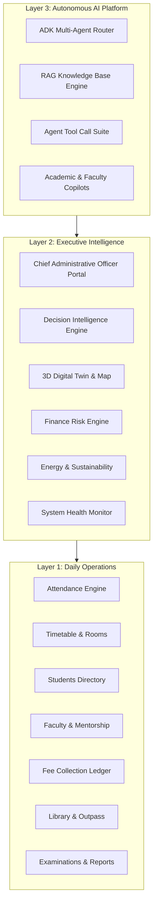

# 🏛️ CampusOS AI v3.0.0 — Enterprise University Operating System


[](https://github.com/Rishisharma029/campusOS/releases)
[](./apps/web/LICENSE)
[](https://github.com/Rishisharma029/campusOS/actions)
[](https://www.typescriptlang.org/)
[](https://react.dev/)
[](https://vitejs.dev/)
[](https://deepmind.google/technologies/gemini/)
[](https://cloud.google.com/run)
[](./apps/web/src/__tests__/)

> **CampusOS AI** is an enterprise-grade, AI-powered University Operating System built to unify daily academic operations, executive intelligence dashboards, and autonomous AI multi-agent orchestration into a cohesive 3-layer architecture.

---

## 📋 Table of Contents
- [Problem Statement](#-problem-statement)
- [Solution](#-solution)
- [Key Features](#-key-features)
- [System Architecture](#-system-architecture)
- [Technology Stack](#-technology-stack)
- [AI & Multi-Agent Architecture](#-ai--multi-agent-architecture)
- [Security & RBAC Infrastructure](#-security--rbac-infrastructure)
- [Testing & Quality Assurance](#-testing--quality-assurance)
- [Installation & Local Setup](#-installation--local-setup)
- [Project Directory Structure](#-project-directory-structure)
- [Contributing](#-contributing)
- [License](#-license)

---

## ❓ Problem Statement

Higher education institutions struggle with fragmented administrative software:
1. **Siloed Systems**: Attendance, fee collection, timetables, and library ledgers exist in separate, non-interoperable portals.
2. **Delayed Executive Visibility**: University leadership lacks real-time predictive analytics on absenteeism, revenue risk, and campus energy consumption.
3. **High Administrative Burden**: Faculty and advisors spend manual hours processing student leaves, manual hall ticket verifications, and room allocations.

---

## 💡 Solution

**CampusOS AI** reorganizes campus operations into a **3-Layer Enterprise Platform**:
- **Layer 1 — Daily Operations**: Streamlined workflows for Attendance, Timetable, Students, Faculty, Courses, Fees, Library, Hostel, Transport, Placement, and Examinations.
- **Layer 2 — Executive Intelligence**: Analytics Hub, Digital Twin 3D spatial mapping, Decision Intelligence Engine, CAO Portal, Energy Portal, and Finance Risk Engine.
- **Layer 3 — Autonomous AI Platform**: ADK Multi-Agent Orchestrator, RAG Document Knowledge Base, Native Tool Execution, Academic Copilot, and Faculty Copilot.

---

## ✨ Key Features

### 📅 Daily Operations (Layer 1)
- **Smart Attendance Management**: Real-time biometric & CCTV scanning simulation with automated 75% threshold recovery calculations.
- **Timetable & Spacefinder**: Class schedule matrix with 1-click vacant room allocation (`ReserveRoom`).
- **Student & Faculty Directories**: Complete demographic records, CGPA logs, parent contacts, and advisor assignment.
- **Fee Collections Ledger**: Financial transaction ledger with GST invoice exports and collection breakdowns.
- **Library & Book Operations**: RFID issue/return management and digital vault catalog.
- **Hostel & Digital Outpass**: Resident curfew tracking and automated parent SMS outpass dispatch.
- **Transport & Fleet Management**: Live bus route monitoring and seating capacity overlays.
- **Examinations & Admissions**: Hall ticket clearance checks and late fee waiver requests.

### 📊 Executive Intelligence (Layer 2)
- **Chief Administrative Officer (CAO) Portal**: Single-prompt executive briefing ("What needs my attention today?") auditing 10 campus modules concurrently.
- **Decision Intelligence Engine**: Multi-turn root-cause reasoning for student absenteeism, room under-utilization, and admission forecasting.
- **3D Digital Twin**: Live spatial campus map with heatmaps for occupancy, canteen queue length, and building energy usage.
- **Finance Intelligence**: 1-click mitigation dispatches (EMI restructuring, parent SMS notices, scholarship grants).
- **Energy & Sustainability**: Real-time kWh consumption tracking and HVAC load optimization.
- **System Health Monitor**: Live platform vitals (99.98% simulated service status, response latency, active AI agents).

### 🤖 Autonomous AI Platform (Layer 3)
- **ADK Multi-Agent Orchestrator**: Keyword-to-agent intent routing dispatching queries to specialized sub-agents (`StudentAgent`, `FacultyAgent`, `AttendanceAgent`, `TimetableAgent`, `FinanceAgent`, `PrincipalAgent`).
- **RAG Knowledge Base**: Grounded policy retrieval across student handbooks, exam rules, and fee structures.
- **Native Tool Calling**: Autonomous tool execution (`SubmitLeaveApplication`, `ReserveRoom`, `GenerateAttendanceReport`, `CalculateAttendanceRecovery`, `SendEmail`).
- **Academic & Faculty Copilots**: OCR lecture note summarization, quiz generation, automated syllabus creation, and Redis cache-aside code generation.

---

## 🏗️ System Architecture

### 3-Layer System Architecture

```mermaid
flowchart TD
    subgraph Layer3 ["Layer 3: Autonomous AI Platform"]
        ADK[ADK Multi-Agent Router]
        RAG[RAG Knowledge Base Engine]
        TOOLS[Agent Tool Call Suite]
        COPILOT[Academic & Faculty Copilots]
    end

    subgraph Layer2 ["Layer 2: Executive Intelligence"]
        CAO[Chief Administrative Officer Portal]
        DECISION[Decision Intelligence Engine]
        TWIN[3D Digital Twin & Map]
        FIN[Finance Risk Engine]
        ENERGY[Energy & Sustainability]
        HEALTH[System Health Monitor]
    end

    subgraph Layer1 ["Layer 1: Daily Operations"]
        ATT[Attendance Engine]
        TIME[Timetable & Rooms]
        STUDENT[Students Directory]
        FACULTY[Faculty & Mentorship]
        FEES[Fee Collection Ledger]
        LIB[Library & Outpass]
        EXAM[Examinations & Reports]
    end

    Layer3 --> Layer2
    Layer2 --> Layer1
```

---

## 💻 Technology Stack

| Category | Technology | Usage in CampusOS |
| :--- | :--- | :--- |
| **Core Framework** | React 19 / TypeScript 5.x | Component Architecture & Type Safety |
| **Build System** | Vite 6.x | Fast HMR & Code-Splitting Bundle Compilation |
| **Styling Engine** | Tailwind CSS 4.x / Vanilla CSS | Design Tokens, Dark Mode, Glassmorphism |
| **Routing** | React Router v7 | Protected SPA Client Routing |
| **Data Grid & Charts** | Recharts / Custom DataGrid | Executive Dashboards & Analytics |
| **State & Context** | React Context (Auth, Role, DB, Realtime) | Global State Management |
| **Icons & UI** | Lucide React | Modern Interface Iconography |
| **Testing** | Vitest / Playwright / Pa11y | Unit, Integration, E2E & Accessibility |

---

## ⚙️ Installation & Local Setup

```bash
# Clone the repository
git clone https://github.com/Rishisharma029/campusOS.git

# Navigate to web directory
cd campusOS/apps/web

# Install dependencies
npm install

# Start development server
npm run dev
```

Open [http://localhost:5173](http://localhost:5173) in your browser.

---

## 📄 License & Community

- [LICENSE](./apps/web/LICENSE) — MIT License
- [SECURITY.md](./apps/web/SECURITY.md) — Security Policy
- [CONTRIBUTING.md](./apps/web/CONTRIBUTING.md) — Contribution Guidelines
- [CHANGELOG.md](./apps/web/CHANGELOG.md) — Release History

---

*CampusOS AI v3.0.0 — Enterprise University Operating System*

