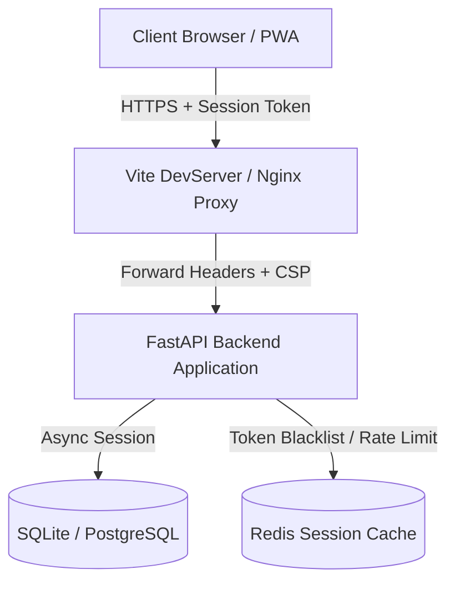

# Security Policy — CampusOS ERP

This document outlines the security architecture, threat model, and defense-in-depth implementations of CampusOS ERP.

---

## 1. Security Architecture & Threat Model

CampusOS adopts a multi-tier defense architecture protecting identity, endpoints, databases, network routing, and assets.

---

## 2. Implemented Security Controls

### 🔑 Authentication & Token Management
* **Memory-Only JWT Storage**: Access tokens are stored strictly in-memory (module-level Javascript variables) during application sessions, preventing **Cross-Site Scripting (XSS)** token theft. Refresh tokens are scoped to sessionStorage/localStorage.
* **Access Token Expiry**: Token lifespan is strictly capped at **30 minutes** (down from 8 days in previous configurations).
* **Token Rotation**: Implemented a fetch-based interceptor doing auto-rotation (using a queue to block concurrent refresh calls) on `401 Unauthorized` responses.
* **MFA (TOTP) Security**: Native MFA engine supporting RFC 6238 Time-Based One-Time Passwords (TOTP) with clock-drift checks.

### 🛡️ Web & API Protections
* **Strict CORS Enforcements**: Banned CORS wildcard origins (`*`) when credentials are allowed, mapping origins to explicit Whitelists read dynamically from settings.
* **Rate Limiting**: Attached `slowapi` rate limiters on credential routes:
  - `/auth/login`: Maximum **5 requests/minute**
  - `/auth/refresh`: Maximum **10 requests/minute**
* **Security Headers**: All API endpoints return security headers via custom Starlette middleware:
  - `Strict-Transport-Security` (HSTS): Capped at `max-age=31536000` (1 year) with subdomains.
  - `X-Frame-Options`: Set to `DENY` to mitigate Clickjacking.
  - `X-Content-Type-Options`: Set to `nosniff` to avoid MIME sniffing.
  - `Content-Security-Policy` (CSP): Bounded default-src to `'self'` and `'unsafe-inline'` + whitelisted `cdn.jsdelivr.net` and `fastly.jsdelivr.net` strictly for Swagger UI documentation pages.

### 🗄️ Database & Input Validation
* **SQL Injection Mitigation**: Strictly parameterized queries using SQLAlchemy 2.0 ORM models and async database sessions. No raw string interpolation is used for queries.
* **Role-Based Access Control (RBAC)**: Route-level navigation guards (`RoleRoute`) and endpoint checks (`PermissionChecker`) enforce granular resource boundaries (e.g. Students/Parents can never access `/students` or `/faculty` endpoints).
* **Strong Production Keys**: In production mode (`ENVIRONMENT=production`), the application enforces cryptographic strength checks on the `SECRET_KEY`. If the key is the development default or is shorter than 32 characters, the application raises a hard validation error and refuses to start up.

---

## 3. Reporting Vulnerabilities

If you identify a security vulnerability in this project, please **do not** open a public issue. Instead, report it privately:

* **Contact**: Rishi Sharma
* **Email**: i.rishisharma2007@gmail.com
* **Format**: Please include a clear description, proof of concept (PoC), and steps to reproduce. We will acknowledge and patch verified vulnerabilities within 48 hours.
