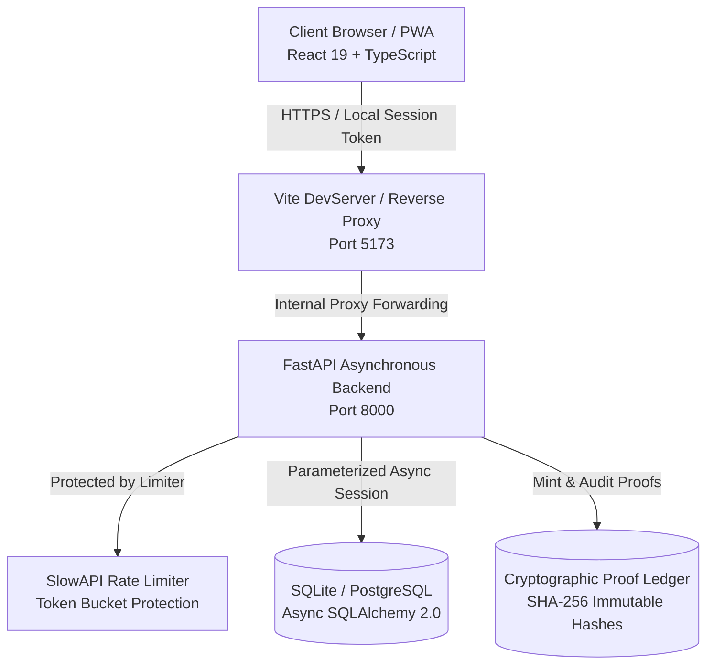

# Security Policy — CampusOS AI (SIH26044)

This document outlines the security architecture, threat model, cryptographic verification protocol, and defense-in-depth implementations of the CampusOS AI University Operating System.

---

## 1. Security Architecture & Threat Model

CampusOS adopts a multi-tier defense-in-depth architecture protecting client identities, API routes, operational databases, and employability verification ledgers.

```mermaid
graph TD
    Client[Client Browser / PWA<br/>React 19 + TypeScript]
    Proxy[Vite DevServer / Reverse Proxy<br/>Port 5173]
    API[FastAPI Asynchronous Backend<br/>Port 8000]
    DB[(SQLite / PostgreSQL<br/>Async SQLAlchemy 2.0)]
    ProofLedger[(Cryptographic Proof Ledger<br/>SHA-256 Immutable Hashes)]
    Limiter[SlowAPI Rate Limiter<br/>Token Bucket Protection]

    Client -->|HTTPS / Local Session Token| Proxy
    Proxy -->|Internal Proxy Forwarding| API
    API -->|Protected by Limiter| Limiter
    API -->|Parameterized Async Session| DB
    API -->|Mint & Audit Proofs| ProofLedger
```

---

## 2. Implemented Security Controls

### 🔑 Authentication & Token Management
* **Memory-Only Access Token Storage**:
  - JWT Access tokens are held strictly in JavaScript module-level memory variables, protecting tokens from Cross-Site Scripting (XSS) extraction via `localStorage`.
  - Scoped refresh tokens are exchanged automatically through an interceptor queue with concurrency locking.
* **Access Token Expiry**: Token lifespan is capped at **30 minutes**, minimizing replay windows.
* **Orphaned Auth Flag Auto-Cleanup**:
  - Frontend authentication initializes with strict validation: if an `auth_active` flag is present without a corresponding access or refresh token, the flag is purged instantly, eliminating infinite redirect loops.
* **Multi-Factor Authentication (MFA / TOTP)**:
  - Supports RFC 6238 Time-Based One-Time Passwords with clock-drift tolerances and token replay rejection.

### 🛡️ Web & API Protections
* **Strict CORS Enforcements**:
  - Wildcard origins (`*`) are banned when credentials are transmitted.
  - Allowed origins are bounded to explicit configurations (`http://localhost:5173`, `http://127.0.0.1:5173`, `http://localhost:3000`).
* **Reverse-Proxy Isolation**:
  - Vite development and Nginx production proxies map `/api/*` and `/health` requests directly to `http://127.0.0.1:8000`, eliminating cross-origin browser hazards.
* **Rate Limiting (SlowAPI)**:
  - Sensitive credential endpoints are strictly rate-limited:
    - `/api/v1/auth/login`: **5 requests/minute**
    - `/api/v1/auth/refresh`: **10 requests/minute**
* **Security Headers Middleware**:
  - Every API response is fortified by Starlette middleware:
    - `Strict-Transport-Security` (HSTS): `max-age=31536000; includeSubDomains`
    - `X-Frame-Options`: `DENY` (Clickjacking mitigation)
    - `X-Content-Type-Options`: `nosniff` (MIME sniffing prevention)
    - `Content-Security-Policy` (CSP): Bounded script and connect directives.

### 📜 Verifiable Credentials & Ledger Integrity (SIH26044)
* **Tamper-Evident SHA-256 Proof Hashing**:
  - Verified student claims (skills, certificates, internships, projects, achievements) are minted with cryptographic verification hashes (`0x...-GENOVA-PROOF`).
  - Claims cannot be modified client-side without invalidating the cryptographic checksum.
* **Multi-Party Verification Gate**:
  - High-stakes credentials require dual verification (AI automated sandbox assessment + authorized faculty jury or industry supervisor signature).

### 🗄️ Database & Input Validation
* **SQL Injection Mitigation**:
  - Strictly parameterized queries using SQLAlchemy 2.0 ORM models with asynchronous query execution. String concatenation in database queries is prohibited.
* **Role-Based Access Control (RBAC)**:
  - Dual-layer RBAC enforcement:
    - **Frontend**: Protected route guards (`RoleRoute`, `PrivateRoute`) reject unauthorized views.
    - **Backend**: FastAPI dependency injectors (`PermissionChecker`, `get_current_active_user`) reject unauthorized requests with HTTP `403 Forbidden`.
* **Production Key Validation Guards**:
  - In production mode (`ENVIRONMENT=production`), the application enforces cryptographic strength checks on `SECRET_KEY`. If the development marker or a key shorter than 32 characters is detected, startup aborts immediately.

---

## 3. Reporting Vulnerabilities

If you identify a security vulnerability in CampusOS AI, please **do not** open a public issue on GitHub. Instead, report it through our responsible disclosure channel:

* **Contact**: Rishi Sharma
* **Email**: `i.rishisharma2007@gmail.com`
* **Subject**: `[SECURITY VULNERABILITY] CampusOS AI - <Brief Description>`
* **Information to Include**:
  1. Description of the vulnerability and attack vector.
  2. Step-by-step Proof of Concept (PoC) or script.
  3. Impact assessment and potential remediation suggestions.

All valid vulnerability disclosures will be acknowledged within **24 hours**, and patches deployed within **48 hours**.
