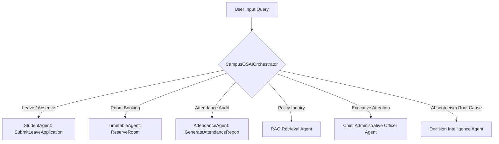

# 🤖 CampusOS AI — Autonomous AI Platform & Multi-Agent Architecture

**Document Version**: 3.0.0  

---

## 🤖 1. Multi-Agent Orchestrator Architecture

The `CampusOSAIOrchestrator` (`multiAgentOrchestrator.ts`) acts as the master coordinator for query classification and sub-agent dispatch.



---

## 📚 2. Grounded RAG Knowledge Base Flow

```mermaid
flowchart LR
    Query[User Policy Question] --> RAGSearch[searchRAGKnowledgeBase()]
    RAGSearch --> Documents[(CAMPUS_KNOWLEDGE_BASE - 7 Docs)]
    Documents -->|Keyword Scoring| Citations[Ranked Document Passages]
    Citations --> GroundedAns[Grounded Response Synthesis]
```

### Knowledge Base Content Domains
1. **Student Handbook (§3.1)**: Attendance threshold (75%) and recovery.
2. **Academic Regulations (§4.2)**: Exam registration and late fee rules.
3. **Syllabus & Electives (§5.4)**: Course prerequisites and track recommendations.
4. **Fee Structure (§2.8)**: Payment installments, penalties, and GST invoicing.
5. **Hostel & Outpass (§6.1)**: Resident curfew (09:30 PM) and digital outpass.
6. **Faculty Directory (§1.2)**: Office hours and email contacts.
7. **Spatial Map Guide (§7.3)**: Lab locations and building wings.
