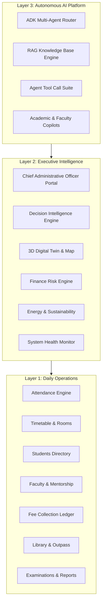
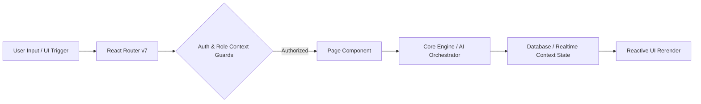

# 🏛️ CampusOS AI — System Architecture & Design Specification

**Document Version**: 3.0.0  
**Target Audience**: Systems Engineers, Solution Architects, Core Maintainers  

---

## 🏢 1. Three-Layer Architectural Paradigm

CampusOS AI separates administrative computing into three distinct runtime layers:

---

## 🔄 2. Data Flow & Request Lifecycle

---

## 📂 3. Component Architecture & Hierarchy

- **Root Layout (`App.tsx`)**: Central router wrapped in context providers (`AuthProvider`, `RoleProvider`, `DatabaseProvider`, `RealtimeProvider`, `ThemeProvider`, `ToastProvider`).
- **Protected Layout (`DashboardLayout.tsx`)**: Integrates responsive `Sidebar` navigation, top `Navbar`, breadcrumb trail, and floating `AIAssistantModal`.
- **Feature Modules (`src/pages/`)**: 35 lazy-loaded module views.
