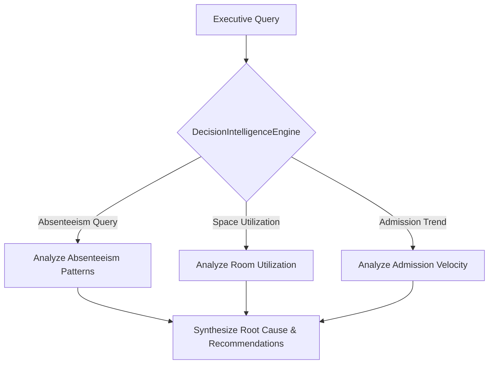

# 🧠 CampusOS AI — Decision Intelligence Engine Architecture

**Document Version**: 3.0.0  

---

## 🔍 Overview

The `DecisionIntelligenceEngine` (`decisionIntelligenceEngine.ts`) provides university executives with multi-turn analytical reasoning for operational anomalies.

### Supported Decision Queries
- **Absenteeism Root Cause Analysis**: Identifies high-absence departments (e.g. Mechanical Engineering at 18.4% vs 5.5% campus baseline).
- **Space Optimization**: Recommends room re-allocation for under-utilized lecture halls.
- **Admission Velocity**: Projects upcoming semester enrollment trends.
