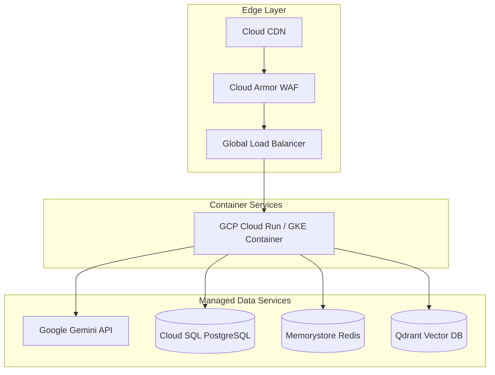

# 🐳 CampusOS AI — Cloud Deployment & Infrastructure Blueprint

**Document Version**: 3.0.0  

---

## ☁️ 1. Cloud Deployment Architecture



---

## 🛠️ 2. Production Containerization (`Dockerfile`)

```dockerfile
# Multi-stage Docker build for Nginx SPA serving
FROM node:20-alpine AS builder
WORKDIR /app
COPY package*.json ./
RUN npm ci
COPY . .
RUN npm run build

FROM nginx:alpine
COPY --from=builder /app/dist /usr/share/nginx/html
COPY nginx.conf /etc/nginx/conf.d/default.conf
EXPOSE 80
CMD ["nginx", "-g", "daemon off;"]
```
