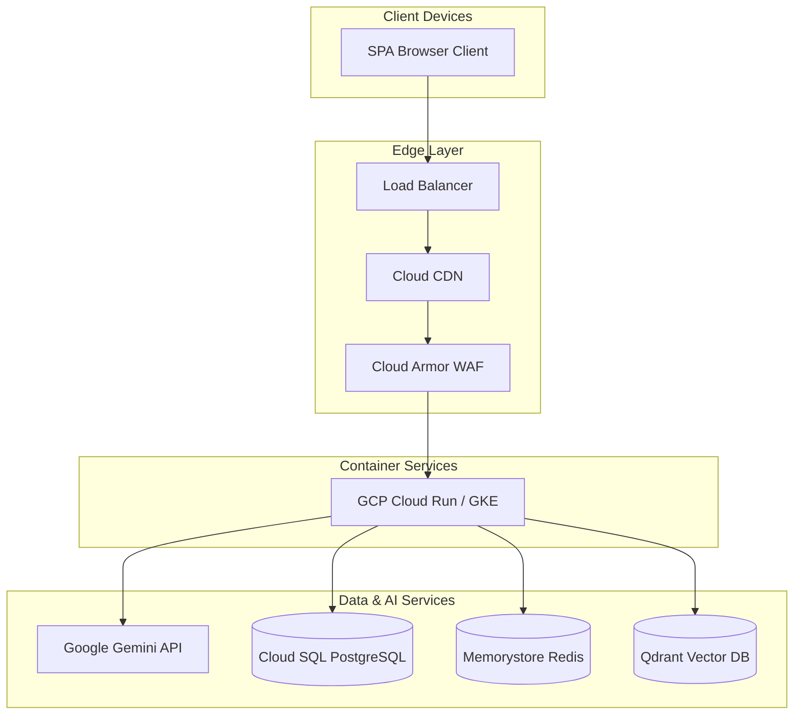

# 🏗️ CampusOS AI — Production Architecture & Deployment Blueprint

**Document Version**: 3.0.0  

---

## ☁️ Planned Production Architecture

```mermaid
flowchart TD
    subgraph Client ["Client Devices"]
        Browser[SPA Browser Client]
    end

    subgraph Edge ["Edge Layer"]
        LB[Load Balancer] --> CDN[Cloud CDN]
        CDN --> WAF[Cloud Armor WAF]
    end

    subgraph Compute ["Container Services"]
        WAF --> CloudRun[GCP Cloud Run / GKE]
    end

    subgraph DataAI ["Data & AI Services"]
        CloudRun --> Gemini[Google Gemini API]
        CloudRun --> Postgres[(Cloud SQL PostgreSQL)]
        CloudRun --> Redis[(Memorystore Redis)]
        CloudRun --> Qdrant[(Qdrant Vector DB)]
    end

    Browser --> LB
```
