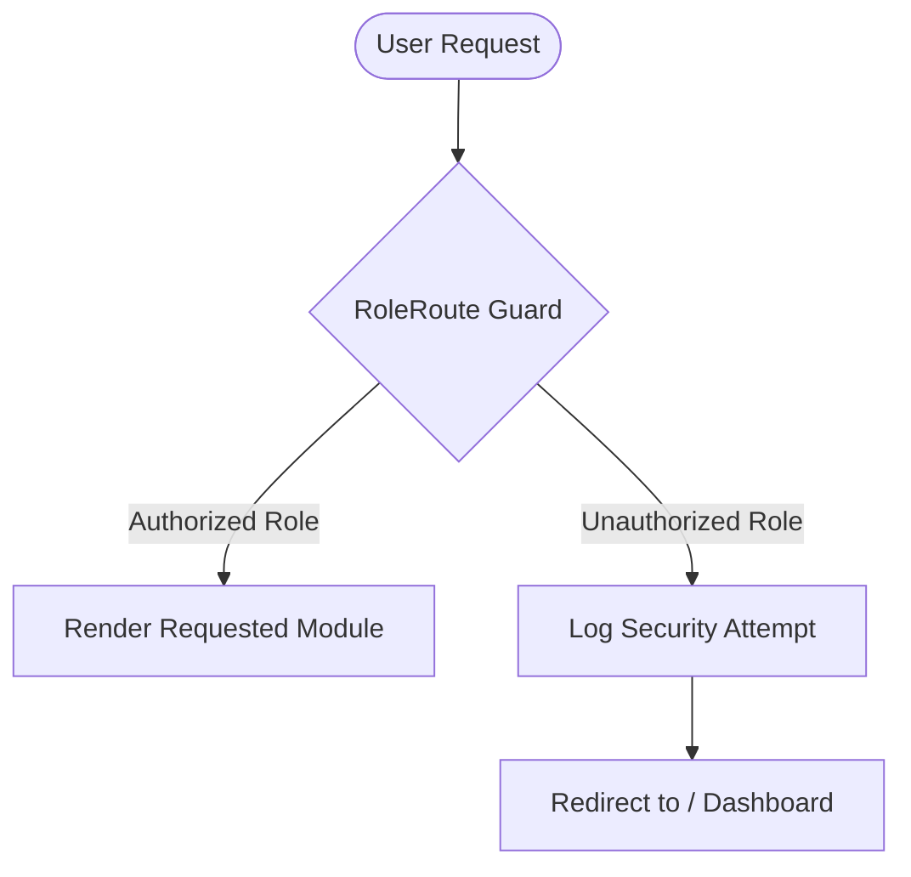

# 🛡️ CampusOS AI — Security Architecture & Threat Model

**Document Version**: 3.0.0  

---

## 🔐 1. Access Control & RBAC Matrix

### RBAC Matrix Across 10 Roles

| Module / Route | Admin | Student | Faculty | Registrar | Parent | Accountant | Librarian | Placement | Hostel | Transport |
| :--- | :---: | :---: | :---: | :---: | :---: | :---: | :---: | :---: | :---: | :---: |
| `/dashboard` | ✅ | ✅ | ✅ | ✅ | ✅ | ✅ | ✅ | ✅ | ✅ | ✅ |
| `/attendance` | ✅ | ✅ | ✅ | ✅ | ✅ | ❌ | ❌ | ❌ | ❌ | ❌ |
| `/fees` | ✅ | ✅ | ❌ | ✅ | ✅ | ✅ | ❌ | ❌ | ❌ | ❌ |
| `/cao` | ✅ | ❌ | ❌ | ✅ | ❌ | ❌ | ❌ | ❌ | ❌ | ❌ |
| `/security-vault`| ✅ | ❌ | ❌ | ❌ | ❌ | ❌ | ❌ | ❌ | ❌ | ❌ |

---

## 🛡️ 2. Defense-in-Depth Security Layers

1. **XSS Input Sanitization**: Strips HTML tags (`<script>`, `<iframe>`) and quotes in AI responses.
2. **Unguarded `JSON.parse` Fail-Safe**: `try/catch` wrapper in `AuthContext` prevents storage corrupt freeze loops.
3. **Protected Navigation**: Direct URL navigation to unpermitted module routes is blocked.
4. **Production Security Roadmap**: Transition to `HttpOnly`, `SameSite=Strict`, `Secure` cookies and RFC 6238 TOTP MFA.
