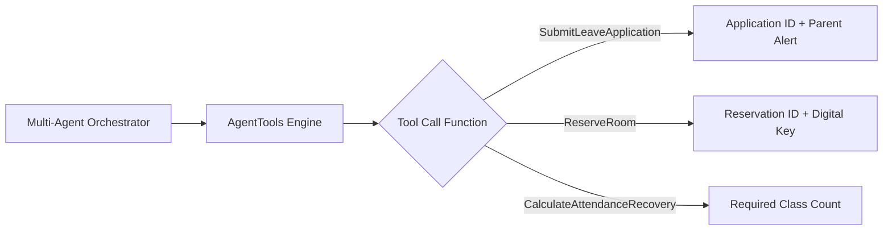

# 🛠️ CampusOS AI — Tool Calling Framework Specification

**Document Version**: 3.0.0  

---

## ⚡ Tool Execution Architecture

### Safety & Null Verification
All tool functions in `agentTools.ts` feature default parameter fallbacks, ensuring deterministic execution even if partial arguments are provided by the user.
